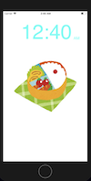
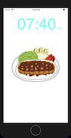
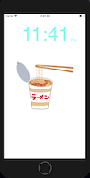

# ClockApp

- this is practice of making ios App by swift. 
- the function is to show the time, and depending on the time you open the app, the image will change.

## example 
- sleeping time

- breakfast time

- lunch time

- dinner time

- nightfood time

