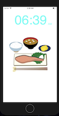
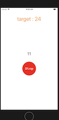
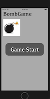
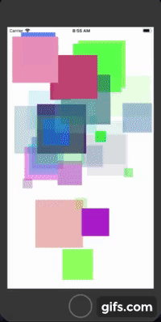
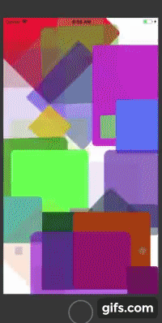
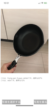
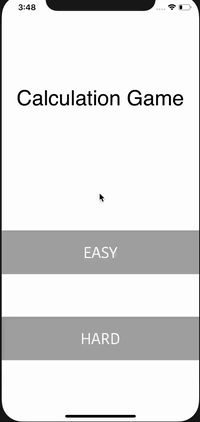
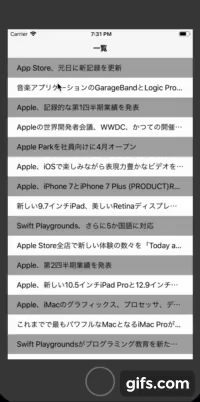

# SwiftPractice
- this is a collection containing the practice of making ios app and game with swift

||name|description|picture|
|:--:|:--:|:--|:--:|
|1|[clockApp](https://github.com/JunNishimura/SwiftPractice/tree/master/ClockApp)|this is the app which gives the time with the picture which shows the propper event. e.g.) in the morning, the picutre will show the breakfast ||
|2|clockTimer|this is the ios game. Stop the button when the increasing number is same with the target number||
|3|BombTimer|this is the ios game. I updated the prev practice(clock Timer). press the button when you see multiples of 3 or number including 3. ||
|4|AnimationRectangle|this app shows the infinite loop of making recntalges whose parameters are all randomized.||
|5|TileAnimation|tiles are mapped on the screen. each tile has randomized parameters ||
|6|AIapp|the practice of AI app with coreML. I tried image recognition with images chosen from the folder or taken by camera.||
|7|CalculationApp|this is just calculation game, but in this app I practiced the communication between multiple views.||
|8|ARapp|you can add objects into the read world by interacting with the screen of iPhone||
|9|RSSReaderApp|this is the practice of the rss reader app. ||
|10|| ||
|11|| ||
|12|| ||
|13|| ||
|14|| ||
|15|| ||
|16|| ||
|17|| ||
|18|| ||
|19|| ||
|20|| ||
