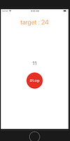

# clockTimer
- this is practice of making ios app
- there is a target number on the screen. By pressing the center button you can stop the couting number increasing by second. this is the game which you stop the increasing number when that number is same with the target number.

# description
- start view 
  - just press the button to start

  

- game view 
  - target number is set as a randomized number ranged from 10 to 30 automatically

  

- playing time
  - you can see the center number is increasing by second

  

- results 
  - if you could stop the button at the propper point

  

  - if you stop the button at the wrong point
  
  
  
  - if you don't press the stop button, and then time goes over 30 seconds(which is the maximum number)
  
  

